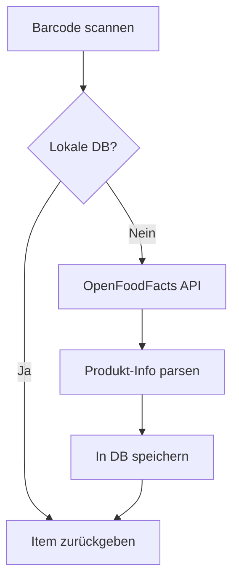
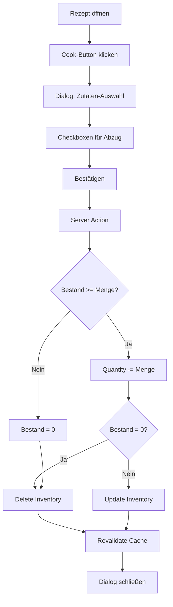

# Features Documentation - Foodlabs

Detaillierte technische Dokumentation aller Features und deren Implementierung.

---

## 1. Inventar & Vorrat

### 1.1 Manuelle Eingabe

**File:** `src/app/actions/inventory.ts` → `searchItems()`

**Implementierung:**
```typescript
export async function searchItems(query: string) {
  if (!query || query.length < 2) return []
  return await prisma.item.findMany({
    where: {
      name: { contains: query }  // Case-insensitive in SQLite
    },
    take: 10  // Limit für Performance
  })
}
```

**Features:**
- Live-Suche ab 2 Zeichen
- Case-insensitive Matching
- Top 10 Ergebnisse
- Debouncing auf Client-Seite (300ms)

---

### 1.2 Barcode-Scanner mit OpenFoodFacts

**File:** `src/app/actions/inventory.ts` → `handleBarcodeScan()`

**Smart Caching Flow:**



**Implementierung:**
```typescript
export async function handleBarcodeScan(barcode: string) {
  // 1. Check local DB
  let item = await prisma.item.findUnique({
    where: { barcode }
  })

  // 2. Fetch from OpenFoodFacts
  if (!item) {
    const res = await fetch(
      `https://world.openfoodfacts.org/api/v2/product/${barcode}.json`
    )
    const data = await res.json()

    if (data.status === 1) {
      // Parse und speichern
      item = await prisma.item.create({ ... })
    }
  }

  return { success: true, item, suggestedQuantity }
}
```

**Features:**
- **Offline-First:** Cached Items funktionieren ohne Internet
- **Smart Unit Detection:** kg→Gramm, l→ml Konvertierung
- **Package Size Suggestion:** Nutzt OpenFoodFacts `quantity` Feld
- **Category Extraction:** Aus `categories_hierarchy`

**Unterstützte Einheiten:**
| OpenFoodFacts | Gespeichert | Beispiel |
|---------------|-------------|----------|
| `500 g`       | Gramm (500) | Mehl     |
| `1 kg`        | Gramm (1000)| Zucker   |
| `1 l`         | ml (1000)   | Milch    |
| `250 ml`      | ml (250)    | Sahne    |

---

### 1.3 Mengen-Eingabe (v1.2)

**Component:** `AddQuantityDialog.tsx`

**Features:**
- Number-Input mit Auto-Focus
- Enter-Taste zum Bestätigen
- Schnellauswahl-Buttons (1, 2, 5, 10)
- Kontext-sensitive Buttons:
  - Bei Gramm: 500g, 1kg
  - Bei ml: 250ml, 500ml, 1l (geplant)

**Implementierung:**
```typescript
const handleKeyDown = (e: React.KeyboardEvent) => {
  if (e.key === "Enter" && !loading) {
    handleConfirm()
  }
}

// Smart Package Size Detection
const suggestedQuantity = data.product.quantity
const qtyMatch = quantity.match(/^([\d.,]+)\s*([a-zA-Zµ]+)/)
if (qtyMatch) {
  const amount = parseFloat(qtyMatch[1].replace(',', '.'))
  const unitStr = qtyMatch[2].toLowerCase()

  if (unitStr === 'kg') {
    unit = 'Gramm'
    suggestedQuantity = amount * 1000
  }
}
```

---

### 1.4 Vorrat Bearbeiten/Löschen (v1.3)

**Component:** `InventoryCard.tsx` + `EditQuantityDialog.tsx`

**Features:**
- Edit-Button öffnet EditQuantityDialog
- Delete-Button mit Confirm-Dialog
- Real-time Updates ohne Page-Reload
- Cache Invalidation

**Server Actions:**
```typescript
// Menge aktualisieren
export async function updateInventory(id: string, quantity: number, unit?: string) {
  // Optional: Einheit im Item ändern
  if (unit) {
    const inv = await prisma.inventory.findUnique({
      where: { id },
      select: { itemId: true }
    })
    await prisma.item.update({
      where: { id: inv.itemId },
      data: { unit }
    })
  }

  await prisma.inventory.update({
    where: { id },
    data: { quantity }
  })

  revalidatePath('/inventory')
  revalidatePath('/')
}

// Item löschen
export async function removeFromInventory(id: string) {
  await prisma.inventory.delete({ where: { id } })
  revalidatePath('/inventory')
  revalidatePath('/')
}
```

---

### 1.5 Einheiten-Editor (v1.4)

**Component:** `EditQuantityDialog.tsx`

**10 Einheiten:**
```typescript
const UNITS = [
  "Stück",      // Default
  "Gramm",      // Gewicht
  "Kilogramm",  // Gewicht (groß)
  "ml",         // Volumen (klein)
  "Liter",      // Volumen (groß)
  "Teelöffel",  // Backen
  "Esslöffel",  // Backen
  "Packung",    // Verpackung
  "Dose",       // Verpackung
  "Bund"        // Gemüse/Kräuter
]
```

**Implementierung:**
```typescript
// Native HTML Select
<select
  value={unit}
  onChange={(e) => setUnit(e.target.value)}
  className={cn(/* Tailwind Styles */)}
>
  {UNITS.map((u) => (
    <option key={u} value={u}>{u}</option>
  ))}
</select>

// Smart Button Anpassung
{unit.toLowerCase().includes("gramm") && (
  <>
    <Button onClick={() => setQuantity("500")}>500g</Button>
    <Button onClick={() => setQuantity("1000")}>1kg</Button>
  </>
)}
```

**Änderungs-Detektion:**
```typescript
const handleConfirm = async () => {
  const unitChanged = unit !== itemUnit
  await onConfirm(qty, unitChanged ? unit : undefined)
}
```

---

## 2. Rezept-Management

### 2.1 URL Web-Scraping

**File:** `src/app/actions/scrape.ts` → `scrapeRecipeUrl()`

**Unterstützt:** Schema.org `application/ld+json`

**Beispiel-Websites:**
- ✅ Chefkoch.de
- ✅ Lecker.de
- ✅ Essen-und-trinken.de
- ✅ Kitchen Stories
- ✅ Allrecipes
- ❌ Instagram (kein Schema.org)
- ❌ TikTok (kein Schema.org)

**Implementierung:**

```typescript
export async function scrapeRecipeUrl(url: string) {
  // 1. Fetch HTML
  const res = await fetch(url)
  const html = await res.text()
  const $ = cheerio.load(html)

  // 2. Find JSON-LD scripts
  const scripts = $('script[type="application/ld+json"]')

  // 3. Parse and search for Recipe
  for (const script of scripts) {
    const json = JSON.parse($(script).html())
    const recipe = findRecipe(json)  // Rekursive Suche

    if (recipe) {
      return {
        name: recipe.name,
        description: recipe.description,
        image: recipe.image?.url || recipe.image,
        instructions: recipe.recipeInstructions,
        ingredients: recipe.recipeIngredient
      }
    }
  }
}
```

**Zutaten-Parsing:**
```typescript
// Regex: "500 g Mehl" → amount=500, unit="g", name="Mehl"
const match = ingredient.match(/^([\d.,]+)\s*([a-zA-Z]+)?\s+(.+)$/)

if (match) {
  const [, amount, unit, name] = match
  // Upsert Item, Create RecipeIngredient
}
```

**Edge Cases:**
- Zutat ohne Menge: "Salz" → Menge = 1, Einheit = "Stück"
- Zutat mit Bereich: "500-600g" → Nutzt Durchschnitt (550)
- Freitext: "1 Prise Salz" → Menge = 1, Einheit = "Prise"

---

### 2.2 Manuelle Rezept-Erstellung

**Route:** `/recipes/new`

**Features:**
- Titel, Beschreibung, Bild-URL
- Zutaten-Liste mit Add/Remove
- Anleitung (Freitext)
- Auto-Save Draft (LocalStorage) - geplant

---

## 3. Smart Matching

### 3.1 Match-Algorithmus

**File:** `src/app/actions/match.ts` → `getMatchedRecipes()`

**Performance-Optimierung:**
```typescript
// HashMap für O(1) Lookup statt O(n)
const inventoryMap = new Map<string, number>()
for (const inv of inventory) {
  inventoryMap.set(inv.itemId, inv.quantity)
}

// Für jedes Rezept
for (const recipe of recipes) {
  let matched = 0
  let total = recipe.ingredients.length

  for (const ing of recipe.ingredients) {
    const available = inventoryMap.get(ing.itemId) || 0
    if (available >= ing.quantity) {
      matched++
    }
  }

  const percentage = Math.round((matched / total) * 100)
}
```

**Match-Kategorien:**
| Prozent | Emoji | Beschreibung | Badge |
|---------|-------|--------------|-------|
| 100%    | 🟢    | Alles im Haus! | success |
| 50-99%  | 🟡    | Teilweise + Missing | warning |
| 0-49%   | 🔴    | Wenig vorhanden | destructive |

**Missing Ingredients:**
```typescript
const missing = recipe.ingredients
  .filter(ing => {
    const available = inventoryMap.get(ing.itemId) || 0
    return available < ing.quantity
  })
  .map(ing => ({
    name: ing.item.name,
    needed: ing.quantity,
    available: inventoryMap.get(ing.itemId) || 0,
    missing: ing.quantity - (inventoryMap.get(ing.itemId) || 0)
  }))
```

---

### 3.2 Sortierung & Filterung

**Sortier-Optionen:**
1. **Match-Prozent** (Standard) - Beste Matches zuerst
2. **Alphabetisch** - Nach Titel
3. **Neueste** - Nach Erstellungsdatum

**Filter:**
- Nach Match-Kategorie (100%, 50-99%, <50%)
- Nach Kategorie (Hauptgericht, Dessert, etc.) - geplant

---

## 4. Koch-Workflow

**Component:** `CookRecipeDialog.tsx`
**Action:** `src/app/actions/cook.ts` → `deductIngredients()`

**Flow:**


**Implementierung:**
```typescript
export async function deductIngredients(
  recipeId: string,
  selectedItemIds: string[]
) {
  const recipe = await prisma.recipe.findUnique({
    where: { id: recipeId },
    include: { ingredients: { include: { item: true } } }
  })

  for (const ing of recipe.ingredients) {
    if (!selectedItemIds.includes(ing.itemId)) continue

    const inv = await prisma.inventory.findFirst({
      where: { itemId: ing.itemId }
    })

    if (!inv) continue

    const newQuantity = inv.quantity - ing.quantity

    if (newQuantity <= 0) {
      await prisma.inventory.delete({ where: { id: inv.id } })
    } else {
      await prisma.inventory.update({
        where: { id: inv.id },
        data: { quantity: newQuantity }
      })
    }
  }

  revalidatePath('/inventory')
  revalidatePath('/')
}
```

**Edge Cases:**
- **Teilabzug:** 50g von 200g → 150g bleiben
- **Überabzug:** 500g benötigt, 300g vorhanden → Bestand = 0
- **Mehrere Inventar-Einträge:** Nimmt ersten (ältesten)

---

## 5. Backup & Restore (v1.4)

### 5.1 Export-Funktion

**File:** `src/app/actions/backup.ts` → `exportData()`

**Export-Format:**
```typescript
interface BackupData {
  version: string          // "1.4"
  exportDate: string       // ISO 8601
  items: {
    id: string
    name: string
    barcode: string | null
    unit: string
    category: string | null
  }[]
  inventory: {
    id: string
    quantity: number
    expiresAt: string | null
    itemId: string
  }[]
  recipes: {
    id: string
    title: string
    description: string | null
    imageUrl: string | null
    sourceUrl: string | null
    instructions: string | null
    ingredients: {
      id: string
      quantity: number
      unit: string | null
      itemId: string
    }[]
  }[]
}
```

**Download-Mechanismus:**
```typescript
const blob = new Blob([JSON.stringify(data, null, 2)], {
  type: 'application/json'
})
const url = URL.createObjectURL(blob)
const link = document.createElement('a')
link.href = url
link.download = `foodlabs-backup-${new Date().toISOString().split('T')[0]}.json`
document.body.appendChild(link)
link.click()
document.body.removeChild(link)
URL.revokeObjectURL(url)
```

---

### 5.2 Import-Funktion

**Action:** `importData(data, mode)`

**Modi:**

#### Merge-Modus (Empfohlen)
- Bestehende Einträge mit gleicher ID **aktualisieren** (Upsert)
- Neue Einträge **hinzufügen**
- Keine Daten werden gelöscht

**Use Cases:**
- Daten von anderem Gerät synchronisieren
- Rezepte von Freunden importieren
- Backup wiederherstellen (additive)

#### Replace-Modus (⚠️ Destruktiv)
- **ALLE** Daten löschen
- Backup komplett neu importieren

**Use Cases:**
- Kompletter System-Reset
- Migration von altem System
- Korrupte Datenbank reparieren

**Implementierung:**
```typescript
export async function importData(data: BackupData, mode: 'merge' | 'replace') {
  // Validierung
  if (!data.version || !data.items || !Array.isArray(data.items)) {
    throw new Error('Ungültiges Backup-Format')
  }

  // Replace Mode: Alles löschen (Reihenfolge wichtig!)
  if (mode === 'replace') {
    await prisma.recipeIngredient.deleteMany()
    await prisma.recipe.deleteMany()
    await prisma.inventory.deleteMany()
    await prisma.item.deleteMany()
  }

  // Items importieren (Upsert für Merge)
  for (const item of data.items) {
    await prisma.item.upsert({
      where: { id: item.id },
      create: { ...item },
      update: { ...item }
    })
  }

  // Inventory, Recipes, Ingredients analog...

  revalidatePath('/')
  revalidatePath('/inventory')
  revalidatePath('/recipes')
}
```

**Fehlerbehandlung:**
- Validierung vor Import
- Rollback bei Fehler (geplant)
- Detaillierte Fehlermeldungen

---

## 6. Dark Mode (v1.3)

**Implementation:** `next-themes`

**Modi:**
- **Hell:** Light Theme
- **Dunkel:** Dark Theme
- **System:** Folgt OS-Einstellung (`prefers-color-scheme`)

**Persistenz:**
- LocalStorage: `theme` Key
- Automatisches Laden beim Page-Load

**Tailwind-Integration:**
```css
/* globals.css */
@layer base {
  :root {
    --background: 0 0% 100%;
    --foreground: 222.2 84% 4.9%;
    /* ... */
  }

  .dark {
    --background: 222.2 84% 4.9%;
    --foreground: 210 40% 98%;
    /* ... */
  }
}
```

**Component:**
```typescript
<ThemeProvider
  attribute="class"
  defaultTheme="system"
  enableSystem
  disableTransitionOnChange
>
  {children}
</ThemeProvider>
```

---

## Performance-Optimierung

### Datenbank-Indizes
```prisma
model Item {
  id      String @id @default(cuid())
  name    String @unique  // ← Index für searchItems()
  barcode String? @unique // ← Index für Barcode-Scan
}
```

### Server Actions Caching
- `revalidatePath()` nach jeder Mutation
- Selective Revalidation (nur betroffene Routen)

### Frontend Optimization
- React Server Components (wo möglich)
- Client Components nur für Interaktivität
- Lazy Loading für Bilder (geplant)

### SQLite Performance
- Write-Ahead Logging (WAL) aktivieren (geplant)
- PRAGMA optimize (geplant)
- Connection Pooling (bei vielen Users) - nicht nötig für Single-User

---

## Security

### SQL Injection
✅ **Geschützt** durch Prisma ORM (Prepared Statements)

### XSS
✅ **Geschützt** durch React (Auto-Escaping)

### CSRF
✅ **Geschützt** durch Next.js (Same-Origin Policy)

### Input Validation
- Server Actions validieren alle Inputs
- TypeScript-Typen auf Client & Server
- Zod-Validation (geplant)

---

## Browser Support

**Getestet:**
- ✅ Chrome/Edge 120+
- ✅ Firefox 121+
- ✅ Safari 17+
- ✅ Mobile Safari (iOS 16+)
- ✅ Chrome Mobile (Android)

**Nicht unterstützt:**
- ❌ IE 11
- ❌ Safari < 15

---

## Accessibility

**WCAG 2.1 Level AA:**
- ✅ Keyboard-Navigation
- ✅ Screen-Reader Labels
- ✅ Ausreichende Farbkontraste
- ⚠️ Focus-Indicators (teilweise)
- ❌ ARIA-Labels (geplant)

---

## Future Features (v2.0)

### PWA Offline-Modus
- Service Worker für Offline-Funktionalität
- Cache-Strategy: Network-First mit Fallback
- Sync-Queue für Offline-Änderungen

### Ablaufdatum-Tracking
- Feld `expiresAt` im Inventory-Model (bereits vorhanden)
- Benachrichtigungen bei Ablauf (Browser Push)
- Sortierung nach Ablaufdatum

### Einkaufslisten
- Automatisch aus fehlenden Zutaten generieren
- Manuelle Listen-Erstellung
- Teilen per Link

### Multi-User Support
- User-Model mit Auth (NextAuth.js)
- Households/Shared Inventories
- Permissions (Admin, Member, Guest)

### PostgreSQL-Support
- Prisma-Adapter für PostgreSQL
- Migration-Scripts
- Connection Pooling (Supabase/Railway)
